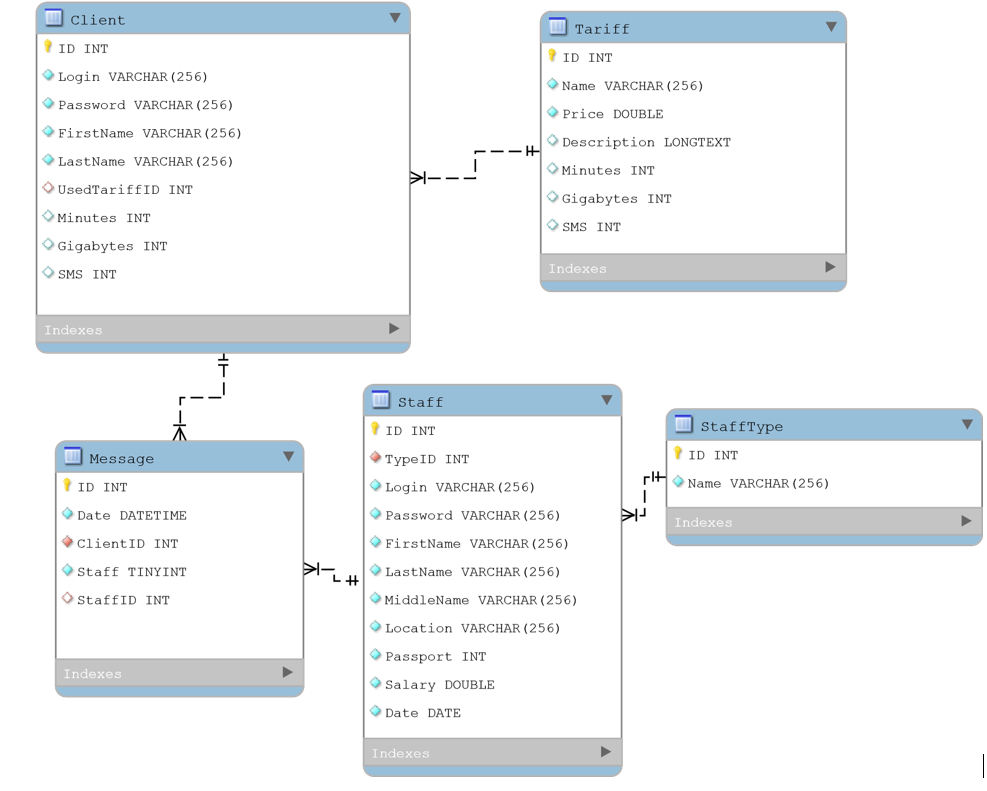

# Курсовой проект по теме "Сотовые операторы"
## Содержание
1. [Описание предметной области & USE CASE](https://github.com/Lairon1/MacSim/tree/Description-of-the-subject-area#%D0%BE%D0%BF%D0%B8%D1%81%D0%B0%D0%BD%D0%B8%D0%B5-%D0%BF%D1%80%D0%B5%D0%B4%D0%BC%D0%B5%D1%82%D0%BD%D0%BE%D0%B9-%D0%BE%D0%B1%D0%BB%D0%B0%D1%81%D1%82%D0%B8)
2. [EER Диаграмма](https://github.com/Lairon1/MacSim/tree/eer)
3. [Web Api](https://github.com/Lairon1/MacSim/tree/WepApiRequestServer)
   * [Как запустить](https://github.com/Lairon1/MacSim/tree/WepApiRequestServer#%D0%BA%D0%B0%D0%BA-%D0%B7%D0%B0%D0%BF%D1%83%D1%81%D1%82%D0%B8%D1%82%D1%8C)
   * [Что он умеет?](https://github.com/Lairon1/MacSim/tree/WepApiRequestServer#%D1%87%D1%82%D0%BE-%D0%BE%D0%BD-%D1%83%D0%BC%D0%B5%D0%B5%D1%82)
     * [GET-Запросы](https://github.com/Lairon1/MacSim/tree/WepApiRequestServer#get-%D0%B7%D0%B0%D0%BF%D1%80%D0%BE%D1%81%D1%8B)
        + [Список тарифов](https://github.com/Lairon1/MacSim/tree/WepApiRequestServer#%D1%81%D0%BF%D0%B8%D1%81%D0%BE%D0%BA-%D1%82%D0%B0%D1%80%D0%B8%D1%84%D0%BE%D0%B2)
     * [POST-Запросы](https://github.com/Lairon1/MacSim/tree/WepApiRequestServer#post-%D0%B7%D0%B0%D0%BF%D1%80%D0%BE%D1%81%D1%8B)
		  + [Регистрация](https://github.com/Lairon1/MacSim/tree/WepApiRequestServer#Регистрация)
		  + [Авторизация](https://github.com/Lairon1/MacSim/tree/WepApiRequestServer#авторизация)
		  + [Пополнение баланса](https://github.com/Lairon1/MacSim/tree/WepApiRequestServer#Пополнение-баланса)
		  + [Оформление тарифа](https://github.com/Lairon1/MacSim/tree/WepApiRequestServer#%D0%BE%D1%84%D0%BE%D1%80%D0%BC%D0%BB%D0%B5%D0%BD%D0%B8%D0%B5-%D1%82%D0%B0%D1%80%D0%B8%D1%84%D0%B0)
		  + [Изменение пароля](https://github.com/Lairon1/MacSim/tree/WepApiRequestServer#%D0%B8%D0%B7%D0%BC%D0%B5%D0%BD%D0%B5%D0%BD%D0%B8%D0%B5-%D0%BF%D0%B0%D1%80%D0%BE%D0%BB%D1%8F)
4. [Client Mobile app](https://github.com/Lairon1/MacSim/tree/Mobile)
   * [SplashScreen](https://github.com/Lairon1/MacSim/blob/Mobile/README.md#SplashScreen)
	* [Авторизация и регистрация](https://github.com/Lairon1/MacSim/blob/Mobile/README.md#%D0%B0%D0%B2%D1%82%D0%BE%D1%80%D0%B8%D0%B7%D0%B0%D1%86%D0%B8%D1%8F-%D0%B8-%D1%80%D0%B5%D0%B3%D0%B8%D1%81%D1%82%D1%80%D0%B0%D1%86%D0%B8%D1%8F)
	* [Главное окно](https://github.com/Lairon1/MacSim/blob/Mobile/README.md#%D0%B3%D0%BB%D0%B0%D0%B2%D0%BD%D0%BE%D0%B5-%D0%BE%D0%BA%D0%BD%D0%BE)
	* [Пополнение баланса](https://github.com/Lairon1/MacSim/blob/Mobile/README.md#%D0%BF%D0%BE%D0%BF%D0%BE%D0%BB%D0%BD%D0%B5%D0%BD%D0%B8%D0%B5-%D0%B1%D0%B0%D0%BB%D0%B0%D0%BD%D1%81%D0%B0)
	* [Тарифы](https://github.com/Lairon1/MacSim/blob/Mobile/README.md#%D1%82%D0%B0%D1%80%D0%B8%D1%84%D1%8B) 
	* [Мой тариф](https://github.com/Lairon1/MacSim/blob/Mobile/README.md#%D0%BC%D0%BE%D0%B9-%D1%82%D0%B0%D1%80%D0%B8%D1%84)
	* [Профиль](https://github.com/Lairon1/MacSim/blob/Mobile/README.md#%D0%BF%D1%80%D0%BE%D1%84%D0%B8%D0%BB%D1%8C)
5. [Приложение для администрирования тарифами](https://github.com/Lairon1/MacSim/tree/Desctop-UnitTests)
	 * [Описание](https://github.com/Lairon1/MacSim/tree/Desctop-UnitTests#%D0%BE%D0%BF%D0%B8%D1%81%D0%B0%D0%BD%D0%B8%D0%B5) 
	* [Авторизация](https://github.com/Lairon1/MacSim/tree/Desctop-UnitTests#%D0%B0%D0%B2%D1%82%D0%BE%D1%80%D0%B8%D0%B7%D0%B0%D1%86%D0%B8%D1%8F)
	* [Окно тарифов](https://github.com/Lairon1/MacSim/tree/Desctop-UnitTests#%D0%BE%D0%BA%D0%BD%D0%BE-%D1%82%D0%B0%D1%80%D0%B8%D1%84%D0%BE%D0%B2)
	* [Создание тарифов](https://github.com/Lairon1/MacSim/tree/Desctop-UnitTests#%D1%81%D0%BE%D0%B7%D0%B4%D0%B0%D0%BD%D0%B8%D0%B5-%D1%82%D0%B0%D1%80%D0%B8%D1%84%D0%BE%D0%B2)
	* [Редактирование тарифов](https://github.com/Lairon1/MacSim/tree/Desctop-UnitTests#%D1%80%D0%B5%D0%B4%D0%B0%D0%BA%D1%82%D0%B8%D1%80%D0%BE%D0%B2%D0%B0%D0%BD%D0%B8%D0%B5-%D1%82%D0%B0%D1%80%D0%B8%D1%84%D0%BE%D0%B2)
	* [Удаление тарифов](https://github.com/Lairon1/MacSim/tree/Desctop-UnitTests#%D1%83%D0%B4%D0%B0%D0%BB%D0%B5%D0%BD%D0%B8%D0%B5-%D1%82%D0%B0%D1%80%D0%B8%D1%84%D0%BE%D0%B2) 

 

<code>
Евсеев      | Вадим | Сервеевич
</code>

# Описание предметной области

Наша компания занимается исключительно распространением своих [услуг](https://ru.wikipedia.org/wiki/%D0%A3%D1%81%D0%BB%D1%83%D0%B3%D0%B0) ([Тарифы](https://ru.wikipedia.org/wiki/%D0%A2%D0%B0%D1%80%D0%B8%D1%84)) и производством пластиково продукта ([Сим-карт](https://ru.wikipedia.org/wiki/%D0%A1%D0%B8%D0%BC-%D0%BA%D0%B0%D1%80%D1%82%D0%B0)). Реализация продажи выглядит так: С начало клиент регистрируется в системе через мобильное приложение вводя свои данные(ФИО, логин, пароль), чтобы получить услугу нужжно выбрать раздел "тарифы", после в разделе будут отображены весь перечень тарифов который есть в базе данных, на виджете с тарифом отображена цена, описание и колиество гигабайт,минут,смс . После этого клиент может нажать на кнопку "Подключить" и перейти к подключанию тарифа. Также пользователь может посмотреть свой тариф по кнопке "Мой тариф".
Пользователь может пополнить баланс нажав по кнопке "Пополнить баланс", после чего его перенесет на форму с пополнением бланса.
Пользователь может посмотреть свой профиль и изменить пароль от своего аккаунта.

### Небольшая статистика за 2020 г.
<code>Продукт      | Общая цена р. | Объём
:-------- |:-----:| -------:
Услуга | 160 000  | 213
Пластиковый продукт| 5 700    | 59
</code>


```
@startuml МакSim

title Use-case cотового оператора "МакSim"

left to right direction

actor "Клиент" as Client
actor "Менеджер" as Manager
actor "Системный администратор" as SysAdmin

usecase "Регистрация нового пользователя" as RegistrationMobile
usecase "Вход в пользовательский акаунт" as LoginUser
usecase "Клиентское мобильное приложение" as MobileApp
usecase "Просмотр тарифов" as ViewTarifs
usecase "Descktop приложение" as DesktopApp
usecase "Оформить тариф" as BuyTarif
usecase "Просмотр и редактирование личного профиля" as ViewProfile
usecase "Войти в учетную запись персонала" as LoginStaff

Client -> MobileApp
Manager -> DesktopApp
SysAdmin -> DesktopApp

MobileApp ..> RegistrationMobile : include
MobileApp ..> LoginUser : include
RegistrationMobile ..> LoginUser : include
DesktopApp ..> LoginStaff: include

LoginUser .up.> ViewTarifs
LoginUser .up.> BuyTarif
LoginUser .up.> ViewProfile

LoginStaff .up.> (Редактирование/добовление/удаление тарифов)
SysAdmin .up.> (Добовление нового персонала)

@enduml
```
# EER 
Для курсового проекта была создана база данных. 

| Client                   |              |              |                                 |
|--------------------------|--------------|--------------|---------------------------------|
| Ключ                     | Имя          | Тип данных   | Описание                        |
| Y                        | ID           | int          | Первичный ключ                  |
|                          | Login        | varchar(256) | Логин                           |
|                          | Password     | varchar(256) | Пароль                          |
|                          | FirstName    | varchar(256) | Имя                             |
|                          | LastName     | varchar(256) | Фамилия                         |
|                          | UsedTariffID | int          | ID используемого тарифа         |
|                          | Minutes      | int          | Количество минут                |
|                          | Gigabytes    | int          | Количество гигабайт             |
|                          | SMS          | int          | Количество сообщений            |
|                          | Balance      | int          | Баланс                          |
|                          | Phonenumber  | int          | Номер телефона                  |

| Tariff                   |              |              |                                 |
|--------------------------|--------------|--------------|---------------------------------|
| Ключ                     | Имя          | Тип данных   | Описание                        |
| Y                        | ID           | int          | Первичный ключ                  |
|                          | Name         | varchar(256) | Название тарифа                 |
|                          | Price        | double       | Цена тарифа                     |
|                          | Description  | longtext     | Описание                        |
|                          | Minutes      | int          | Количество минут                |
|                          | Gigabytes    | int          | Количество гигабайт             |
|                          | SMS          | int          | Количество сообщений            |

| Staff                    |              |              |                                 |
|--------------------------|--------------|--------------|---------------------------------|
| Ключ                     | Имя          | Тип данных   | Описание                        |
| Y                        | ID           | int          | Первичный ключ                  |
|                          | TypeID       | int          | ID типа професии                |
|                          | Login        | varchar(256) | Логин                           |
|                          | Password     | varchar(256) | Пароль                          |
|                          | FirstName    | varchar(256) | Имя                             |
|                          | LastName     | varchar(256) | Фамилия                         |
|                          | MiddleName   | varchar(256) | Отчество                        |
|                          | Location     | varchar(256) | Прописка                        |
|                          | Passport     | int          | Паспорт                         |
|                          | Salary       | double       | Оклад                           |
|                          | Date         | Date         | С какого времени начал работать |

| StaffType                |              |              |                                 |
|--------------------------|--------------|--------------|---------------------------------|
| Ключ                     | Имя          | Тип данных   | Описание                        |
| Y                        | ID           | int          | Первичный ключ                  |
|                          | Name         | varchar(256) | Название должности              |

| ChangePasswordClientLogs |              |              |                                 |
|--------------------------|--------------|--------------|---------------------------------|
| Ключ                     | Имя          | Тип данных   | Описание                        |
| Y                        | ID           | int          | Первичный ключ                  |
|                          | ClientID     | INT          | ID клиента                      |
|                          | NewPassword  | varchar(256) | Новый пароль                    |
|                          | Date         | DateTime     | Дата изменения                  |

Также эта таблица есть в формате xlsx в документе База данных для курсача.xlsx в этой ветке.



# Web API
Для курсового проекта было разработано Web request API.

# Содержание
1. [Как запустить](https://github.com/Lairon1/MacSim/tree/WepApiRequestServer#%D0%BA%D0%B0%D0%BA-%D0%B7%D0%B0%D0%BF%D1%83%D1%81%D1%82%D0%B8%D1%82%D1%8C)
2. [Что он умеет?](https://github.com/Lairon1/MacSim/tree/WepApiRequestServer#%D1%87%D1%82%D0%BE-%D0%BE%D0%BD-%D1%83%D0%BC%D0%B5%D0%B5%D1%82)
   * [GET-Запросы](https://github.com/Lairon1/MacSim/tree/WepApiRequestServer#get-%D0%B7%D0%B0%D0%BF%D1%80%D0%BE%D1%81%D1%8B)
      + [Список тарифов](https://github.com/Lairon1/MacSim/tree/WepApiRequestServer#%D1%81%D0%BF%D0%B8%D1%81%D0%BE%D0%BA-%D1%82%D0%B0%D1%80%D0%B8%D1%84%D0%BE%D0%B2)
   * [POST-Запросы](https://github.com/Lairon1/MacSim/tree/WepApiRequestServer#post-%D0%B7%D0%B0%D0%BF%D1%80%D0%BE%D1%81%D1%8B)
		+ [Регистрация](https://github.com/Lairon1/MacSim/tree/WepApiRequestServer#Регистрация)
		+ [Авторизация](https://github.com/Lairon1/MacSim/tree/WepApiRequestServer#авторизация)
		+ [Пополнение баланса](https://github.com/Lairon1/MacSim/tree/WepApiRequestServer#Пополнение-баланса)
		+ [Оформление тарифа](https://github.com/Lairon1/MacSim/tree/WepApiRequestServer#%D0%BE%D1%84%D0%BE%D1%80%D0%BC%D0%BB%D0%B5%D0%BD%D0%B8%D0%B5-%D1%82%D0%B0%D1%80%D0%B8%D1%84%D0%B0)
		+ [Изменение пароля](https://github.com/Lairon1/MacSim/tree/WepApiRequestServer#%D0%B8%D0%B7%D0%BC%D0%B5%D0%BD%D0%B5%D0%BD%D0%B8%D0%B5-%D0%BF%D0%B0%D1%80%D0%BE%D0%BB%D1%8F)
## Как запустить
Для того чтобы запустить сервер нужно иметь на компьютере установленную java 11 версии не меньше.
Нужно загрузить Server.jar из этой ветки и с помощью консольной команды:

    java -jar Server.jar

После этого сервер запустится на порту 80.
## Что он умеет?
### GET-Запросы
#### Список тарифов
Чтобы получить список тарифов нужно отправить GET запрос по адресу serverip/tariff
Ответ придет в виде JSON.
Пример:

	{
	    "Tariffs": [
	        {
	            "ID": 1,
	            "Name": "Безлимитный интернет",
	            "Price": 899,
	            "Description": "Безлимитный интернет на каждом уголке планеты",
	            "Minutes": 400,
	            "Gigabytes": -1,
	            "SMS": 300
	        },
	        {
	            "ID": 2,
	            "Name": "Безлимитные минуты и SMS",
	            "Price": 599,
	            "Description": "Общайтесь сколько влезет!",
	            "Minutes": -1,
	            "Gigabytes": 10,
	            "SMS": -1
	        }
	    ]
    }

Коды ответа:
| Код | значение |
|--|--|
| 500 | Серверная ошибка |
| 200| Удачно |

В любом случае при ошибке сервер отправит JSON с сообщением ошибки
Пример:

    {
	    "ERROR":"Error Message"
    }

### POST-Запросы
#### Регистрация
Чтобы зарегистрировать пользователя нужно отправить POST запрос на адрес serverip/register
Тело запроса должно быть в JSON и иметь такой вид:

    {
	    "Login":"LoginExemple",
	    "Password":"PasswordExemple",
	    "Firstname":"FirstnameExemple",
	    "Lastname":"LastnameExemple"
    }
Ответ придет в виде JSON
Пример:

	{
	    "Client": {
	        "ID": 39,
	        "Login": "LoginExemple",
	        "Password": "PasswordExemple",
	        "FirstName": "FirstnameExemple",
	        "LastName": "LastnameExemple",
	        "Minutes": 0,
	        "Gigabytes": 0,
	        "SMS": 0,
	        "Balance": 0,
	        "PhoneNumber": 87773631335
	    }
	}
Коды ответа:
| Код | Значение |
|--|--|
| 500 | Серверная ошибка |
| 200| Удачно |
| 405| Был использован не POST запрос |
| 401| Логин или пароль не соответствуют требованиям |
| 400 | Не валидное тело json запроса |
В любом случае при ошибке сервер отправит JSON с сообщением ошибки
Пример:

    {
	    "ERROR":"Error Message"
    }
#### Авторизация
Чтобы зарегистрировать пользователя нужно отправить POST запрос на адрес serverip/login
Тело запроса должно быть в JSON и иметь такой вид:

    {
	    "Login":"LoginExemple",
	    "Password":"PasswordExemple"
    }
Ответ придет в виде JSON
Пример:

	{
	    "Client": {
	        "ID": 36,
	        "Login": "LoginExemple",
	        "Password": "PasswordExemple",
	        "FirstName": "FirstNameExemple",
	        "LastName": "LastNameExemple",
	        "UsedTariff": {
	            "ID": 4,
	            "Name": "Безлимит на все!",
	            "Price": 999,
	            "Description": "Безлимитные минуты, гигабайты и SMS!",
	            "Minutes": -1,
	            "Gigabytes": -1,
	            "SMS": -1
	        },
	        "Minutes": -1,
	        "Gigabytes": -1,
	        "SMS": -1,
	        "Balance": 1,
	        "PhoneNumber": 87778452434
	    }
	}

Коды ответа:
| Код | Значение |
|--|--|
| 200| Удачно |
| 405| Был использован не POST запрос |
| 401| Неверный логин или пароль |
| 400 | Не валидное тело json запроса |
В любом случае при ошибке сервер отправит JSON с сообщением ошибки
Пример:

    {
	    "ERROR":"Error Message"
    }
#### Пополнение баланса
Чтобы зарегистрировать пользователя нужно отправить POST запрос на адрес serverip/topUpBalance
Тело запроса должно быть в JSON и иметь такой вид:

    {
	    "Login":"LoginExemple",
	    "Password":"PasswordExemple",
	    "TopUpBalance":1
    }
Ответ придет в виде JSON
Пример:

	{
	    "Client": {
	        "ID": 36,
	        "Login": "LoginExemple",
	        "Password": "PasswordExemple",
	        "FirstName": "FirstNameExemple",
	        "LastName": "LastNameExemple",
	        "UsedTariff": {
	            "ID": 4,
	            "Name": "Безлимит на все!",
	            "Price": 999,
	            "Description": "Безлимитные минуты, гигабайты и SMS!",
	            "Minutes": -1,
	            "Gigabytes": -1,
	            "SMS": -1
	        },
	        "Minutes": -1,
	        "Gigabytes": -1,
	        "SMS": -1,
	        "Balance": 1,
	        "PhoneNumber": 87778452434
	    }
	}

Коды ответа:
| Код | Значение |
|--|--|
| 200 | Удачно |
| 405 | Был использован не POST запрос |
| 401 | Неверный логин или пароль (Или не валидная сумма пополнения) |
| 400 | Не валидное тело json запроса |
В любом случае при ошибке сервер отправит JSON с сообщением ошибки
Пример:

    {
	    "ERROR":"Error Message"
    }
#### Оформление тарифа
Чтобы зарегистрировать пользователя нужно отправить POST запрос на адрес serverip/hookUpTariff
Тело запроса должно быть в JSON и иметь такой вид:

    {
	    "Login":"LoginExemple",
	    "Password":"PasswordExemple",
	    "TariffID":1
    }
Ответ придет в виде JSON
Пример:

	{
	    "Client": {
	        "ID": 36,
	        "Login": "LoginExemple",
	        "Password": "PasswordExemple",
	        "FirstName": "FirstNameExemple",
	        "LastName": "LastNameExemple",
	        "UsedTariff": {
	            "ID": 4,
	            "Name": "Безлимит на все!",
	            "Price": 999,
	            "Description": "Безлимитные минуты, гигабайты и SMS!",
	            "Minutes": -1,
	            "Gigabytes": -1,
	            "SMS": -1
	        },
	        "Minutes": -1,
	        "Gigabytes": -1,
	        "SMS": -1,
	        "Balance": 1,
	        "PhoneNumber": 87778452434
	    }
	}

Коды ответа:
| Код | Значение |
|--|--|
| 500 | Серверная ошибка |
| 200 | Удачно |
| 405 | Был использован не POST запрос |
| 401 | Неверный логин или пароль (Или не валидный ID тарифа или недостаточно средств) |
| 400 | Не валидное тело json запроса |
В любом случае при ошибке сервер отправит JSON с сообщением ошибки
Пример:

    {
	    "ERROR":"Error Message"
    }
#### Изменение пароля
Чтобы зарегистрировать пользователя нужно отправить POST запрос на адрес serverip/changePassword
Тело запроса должно быть в JSON и иметь такой вид:

    {
	    "Login":"LoginExemple",
	    "Password":"PasswordExemple",
	    "ChangePassword":"ChangePasswordExemple"
    }
Ответ придет в виде JSON
Пример:

	{
	    "Client": {
	        "ID": 36,
	        "Login": "LoginExemple",
	        "Password": "PasswordExemple",
	        "FirstName": "FirstNameExemple",
	        "LastName": "LastNameExemple",
	        "UsedTariff": {
	            "ID": 4,
	            "Name": "Безлимит на все!",
	            "Price": 999,
	            "Description": "Безлимитные минуты, гигабайты и SMS!",
	            "Minutes": -1,
	            "Gigabytes": -1,
	            "SMS": -1
	        },
	        "Minutes": -1,
	        "Gigabytes": -1,
	        "SMS": -1,
	        "Balance": 1,
	        "PhoneNumber": 87778452434
	    }
	}

Коды ответа:
| Код | Значение |
|--|--|
| 500 | Серверная ошибка |
| 200 | Удачно |
| 405 | Был использован не POST запрос |
| 401 | Неверный логин или пароль (Или не валидный новый пароль) |
| 400 | Не валидное тело json запроса |
В любом случае при ошибке сервер отправит JSON с сообщением ошибки
Пример:

    {
	    "ERROR":"Error Message"
    }
